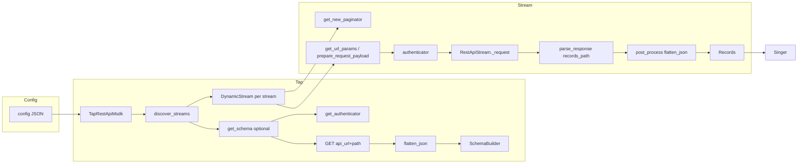

# Repository Architecture — tap-rest-api-msdk

## Metadata

| Field | Value |
|-------|--------|
| Version | 1.0 |
| Last Updated | 2025-03-10 |
| Tags | architecture, repository, singer, meltano-sdk, rest-api, tap |
| Cross-References | [AI_CONTEXT_QUICK_REFERENCE.md](AI_CONTEXT_QUICK_REFERENCE.md) (commands, entry points), [AI_CONTEXT_PATTERNS.md](AI_CONTEXT_PATTERNS.md) (patterns) |

---

## High-Level Overview

`tap-rest-api-msdk` is a **Singer tap** for generic REST APIs, built with the Meltano SDK. It extracts data from configurable REST endpoints and emits Singer-formatted records. Its main differentiator is **schema auto-discovery**: stream schemas can be inferred from sample API responses (optionally overridden by path or inline config). The tap supports multiple authentication methods (Basic, API Key, Bearer, OAuth, AWS), several pagination styles, incremental replication via bookmarks, and optional raw-JSON storage.

**Main components** (discovered from repo layout):

- **tap** — Singer Tap entry; config schema, stream discovery, schema inference.
- **streams** — `DynamicStream`; per-stream sync, URL/params, pagination strategy, post-processing.
- **client** — `RestApiStream`; HTTP session, request/response handling, 404-as-end-of-stream.
- **auth** — Authenticator selection and caching (API Key, Basic, Bearer, OAuth, AWS).
- **pagination** — Custom paginators (offset, page-number, header-link, etc.).
- **utils** — JSON flattening, start-date resolution, dict unnesting.

Data flows: **Config → Tap → Stream discovery (with optional schema inference) → RestApiStream requests → Auth + Pagination → Parse → Flatten → Emit records.**

---

## Directory Structure

```
tap-rest-api-msdk/
├── tap_rest_api_msdk/          # Main package
│   ├── __init__.py
│   ├── tap.py                   # Tap class; discovery, schema inference
│   ├── streams.py               # DynamicStream; sync, pagination, post_process
│   ├── client.py                # RestApiStream; HTTP, 404 handling
│   ├── auth.py                  # Authenticators (Basic, API Key, Bearer, OAuth, AWS)
│   ├── pagination.py            # Custom paginators (offset, page, header-link)
│   └── utils.py                 # flatten_json, unnest_dict, get_start_date
├── tests/                       # Test suite
│   ├── __init__.py
│   ├── test_tap.py
│   ├── test_streams.py
│   ├── test_utils.py
│   ├── test_core.py
│   ├── test_404_end_of_stream.py
│   └── schema.json
├── docs/
│   └── AI_CONTEXT/              # AI context docs (this file, quick ref, patterns)
├── .cursor/                     # Rules, skills, workflows, conventions
├── .github/                     # CI (ci.yml, releases.yml), CODEOWNERS, dependabot
├── config.sample.json           # Sample tap config
├── pyproject.toml               # Build, deps, scripts, ruff, mypy
├── install.sh                   # Venv + deps + test run
├── README.md
└── meltano.yml                  # Meltano plugin definition
```

Per `.cursor/CONVENTIONS.md`: `{context_docs_dir}` = `docs/AI_CONTEXT`; `{features_dir}` = `_features`, `{bugs_dir}` = `_bugs`, `{archive_dir}` = `_archive` (if used).

---

## Component Responsibilities

### tap (`tap_rest_api_msdk/tap.py`)

- **TapRestApiMsdk** subclasses `singer_sdk.Tap`.
- Defines **config_jsonschema** (top-level + stream-level): `api_url`, auth options, pagination/backoff, stream list with path, params, headers, `records_path`, primary/replication keys, `except_keys`, `num_inference_records`, optional `schema` (path or object).
- **discover_streams()**: Iterates `config["streams"]`, merges stream vs top-level settings, resolves schema (file path, inline dict, or **get_schema()** inference), instantiates **DynamicStream** per stream with shared/cached **authenticator**.
- **get_schema()**: If no schema provided, performs a GET to `api_url + path`, uses **auth** (and caches `_authenticator`), extracts records via `records_path`, flattens with **utils.flatten_json**, infers schema via `genson.SchemaBuilder` over sample records (and optional `_sdc_raw_json`).
- **Entry point**: CLI is `TapRestApiMsdk.cli` (Singer SDK); script in `pyproject.toml`: `tap-rest-api-msdk = "tap_rest_api_msdk.tap:TapRestApiMsdk.cli"`.

### streams (`tap_rest_api_msdk/streams.py`)

- **DynamicStream** extends **RestApiStream** (client).
- Holds per-stream config: path, params, headers, `records_path`, primary_keys, replication_key, `except_keys`, pagination style and params, backoff options, `store_raw_json_message`, optional authenticator.
- **get_new_paginator()**: Returns SDK or custom paginator by `pagination_request_style` (e.g. `default`/`jsonpath_paginator`, `offset_paginator`, `restapi_header_link_paginator`, `page_number_paginator`, `simple_offset_paginator`, etc.).
- **get_url_params** / **prepare_request_payload**: Chosen by `pagination_response_style` (page, offset, header_link, hateoas_body); inject replication/since and pagination params.
- **parse_response()**: Uses `records_path` (JSONPath) to yield raw records from response.
- **post_process()**: Flattens each row via **utils.flatten_json** (with `except_keys`, optional `_sdc_raw_json`).
- **backoff_wait_generator()**: Overridable for rate limits (message or header-based backoff).

### client (`tap_rest_api_msdk/client.py`)

- **RestApiStream** subclasses `singer_sdk.streams.RESTStream`.
- **url_base**: From `config["api_url"]`.
- **authenticator**: Property that calls **auth.get_authenticator(self)**; caches on tap/stream.
- **_request()**: Sends prepared request via authenticator and session; **404 on next-page** is treated as end-of-stream (no exception); otherwise **validate_response(response)**.
- **request_records()**: Uses paginator, prepare_request, _request; on 404 breaks and yields only prior pages; otherwise parse_response → yield records and advance paginator.

### auth (`tap_rest_api_msdk/auth.py`)

- **get_authenticator(self)**: Reads `auth_method` from config (tap or stream); caches `_authenticator` on `self`; OAuth checks token validity and refreshes; AWS sets `http_auth`. Returns SDK authenticator or **APIAuthenticatorBase** when `no_auth`.
- **select_authenticator(self)**: Maps `auth_method` to **APIKeyAuthenticator**, **BasicAuthenticator**, **ConfigurableOAuthAuthenticator**, **BearerTokenAuthenticator**, or AWS (**AWSConnectClient** + **AWS4Auth**). Uses `api_keys`, `username`/`password`, `access_token_url`/`client_id`/`client_secret`/`grant_type`/etc., `bearer_token`, `aws_credentials`.
- **ConfigurableOAuthAuthenticator**: Extends SDK OAuthAuthenticator; **oauth_request_body** built from config; **get_initial_oauth_token** for discovery.
- **AWSConnectClient**: Builds boto3 session and **AWS4Auth** from config/env.

### pagination (`tap_rest_api_msdk/pagination.py`)

- **RestAPIBasePageNumberPaginator**: Page-number style; **has_more** from JSONPath or `hasMore`.
- **RestAPIOffsetPaginator**: Offset/limit; **has_more** from response pagination object and `pagination_total_limit_param`.
- **SimpleOffsetPaginator**: **has_more** by comparing record count (via optional `offset_records_jsonpath`) to page size.
- **RestAPIHeaderLinkPaginator**: Link header "next"; optional results limit and `use_fake_since_parameter` for replication_key-based early exit.

### utils (`tap_rest_api_msdk/utils.py`)

- **flatten_json(obj, except_keys, store_raw_json_message)**: Recursively flattens dict; lists and `except_keys` become JSON strings; keys normalized (e.g. `-.` → `__`); optional `_sdc_raw_json` field.
- **unnest_dict(d)**: Single-level flatten of nested dicts (used in pagination).
- **get_start_date(self, context)**: Returns bookmark timestamp or replication key value as string for use in URL/body params.

---

## Data Flow

End-to-end (discover/sync):



- **Discovery**: Config → Tap discovers streams → for each stream, schema from file/dict or GET + flatten + genson → build DynamicStream list.
- **Sync**: For each stream, paginator + prepare_request (with auth, replication, pagination params) → _request → parse_response → post_process (flatten) → emit records. 404 on next-page ends stream without raising.

---

## Service/Module Boundaries & Dependencies

| Component | Depends on | External libs |
|-----------|------------|----------------|
| tap | streams (DynamicStream), auth (get_authenticator), utils (flatten_json) | singer_sdk, genson, requests, singer_sdk.helpers.jsonpath |
| streams | client (RestApiStream), pagination (all paginators), utils (flatten_json, get_start_date) | singer_sdk (streams, pagination, types, jsonpath), requests |
| client | auth (get_authenticator) | singer_sdk.streams.RESTStream, requests |
| auth | — | singer_sdk.authenticators, boto3, requests_aws4auth |
| pagination | utils (unnest_dict) | singer_sdk.pagination, singer_sdk.helpers.jsonpath, requests, dateutil |
| utils | — | json (stdlib) |

Boundaries: **tap** owns discovery and schema inference; **streams** own stream-specific sync and pagination strategy; **client** owns HTTP and 404 semantics; **auth** is used by tap (discovery) and by streams/client (sync); **pagination** is used only by streams; **utils** is used by tap, streams, and pagination.

---

## Entry Points & Extension Hooks

- **CLI entry**: `tap-rest-api-msdk` → `tap_rest_api_msdk.tap:TapRestApiMsdk.cli` (Singer standard: `--config`, `--catalog`, `--state`, `--discover`).
- **Stream discovery**: Override **discover_streams()** to change how stream list is built; add streams or alter config resolution.
- **Schema**: Provide `schema` (file path or object) on a stream to skip inference; or extend **get_schema()** for custom inference.
- **New auth**: In **auth.select_authenticator()**, add a branch for a new `auth_method` and return an SDK-compatible authenticator.
- **New pagination**: Add a branch in **DynamicStream.get_new_paginator()** for a new `pagination_request_style` and implement a paginator (subclass of SDK base or custom with `current_value`, `advance()`, `finished`). Optionally add a **get_url_params**/prepare_request_payload style in streams.
- **Backoff**: **DynamicStream.backoff_wait_generator()** already supports `message` and `header`; extend for other response shapes.
- **Post-processing**: Override **DynamicStream.post_process()** (e.g. after super) to add or transform fields.
- **Request/response**: **RestApiStream._request()** and **request_records()** are the extension points for custom HTTP behavior (e.g. 404 handling is already centralized here).

---

*End of document. For commands and runtime details see [AI_CONTEXT_QUICK_REFERENCE.md](AI_CONTEXT_QUICK_REFERENCE.md). For patterns see [AI_CONTEXT_PATTERNS.md](AI_CONTEXT_PATTERNS.md).*
